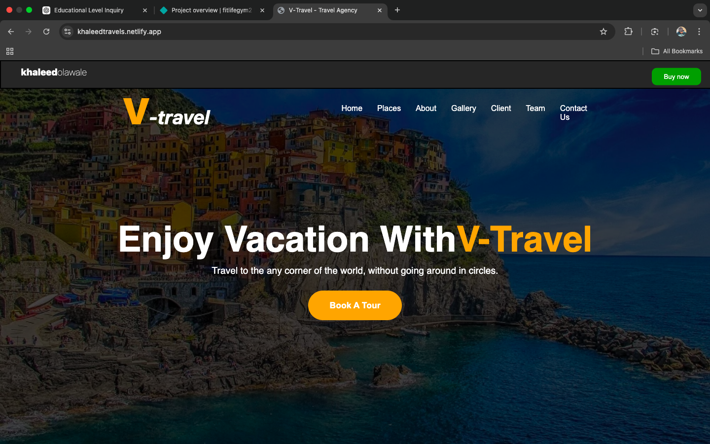
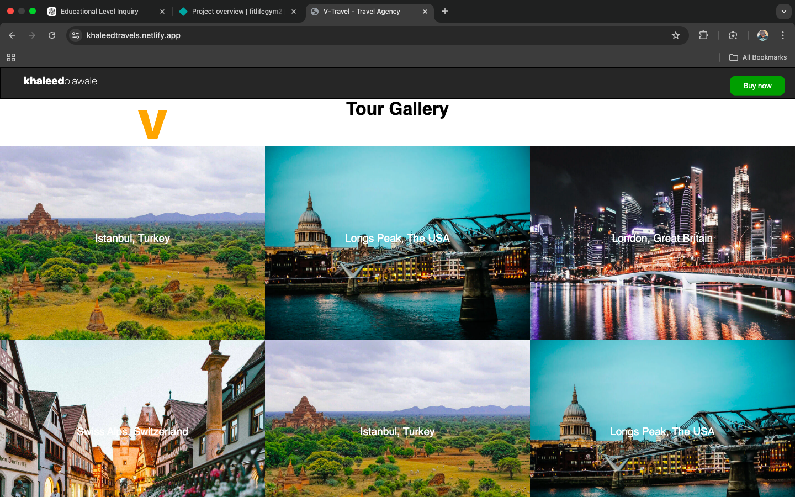

# 🌍 V-Travel Agency

A responsive travel website built with HTML, CSS, and minimal JavaScript, designed to showcase travel destinations, company info, client feedback, gallery of experiences, and the team behind the adventures.

---

## 🚀 Live Demo
https://khaleedtravels.netlify.app/

---

## 💻 GitHub Repository
https://github.com/khaleedolawale/travel

---

## 🛠️ Built With
- HTML
- CSS
- JavaScript (small interactive features)

---

## 📸 Screenshot

---

## 📂 Project Structure
travel-website/
├── index.html # Homepage
├── about.html # About section
├── gallery.html # Gallery of places
├── clients.html # Client feedback section
├── team.html # Team members
├── assets/
│ ├── css/style.css
│ └── js/main.js
└── images/ # Travel images

---

## 📌 Features
- Responsive design (mobile-friendly)
- Places section showcasing destinations
- About section introducing the company
- Gallery of travel experiences
- Client testimonials
- Team members showcase
- Minimal JavaScript for smooth interactivity

---

## 🎯 Purpose
This project was built to create an attractive, user-friendly travel website that highlights destinations, client feedback, and the team behind the experiences, demonstrating front-end web development skills.

---

## 📬 Contact
Feel free to reach out for collaboration, feedback, or inquiries.

---

## ⭐ Acknowledgements
Inspired by modern travel websites and built as a portfolio project to showcase HTML, CSS, and JavaScript skills.
